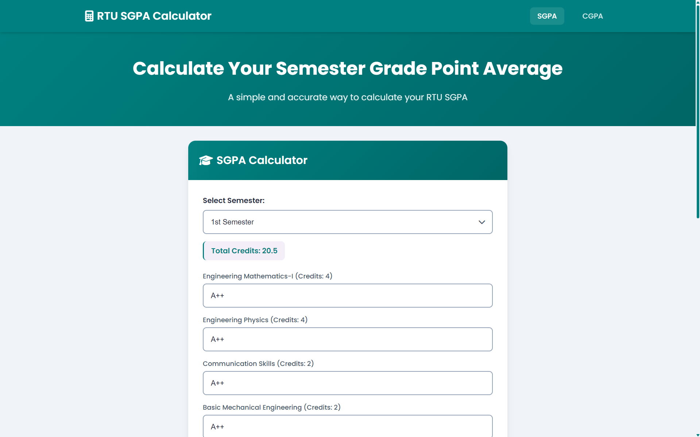
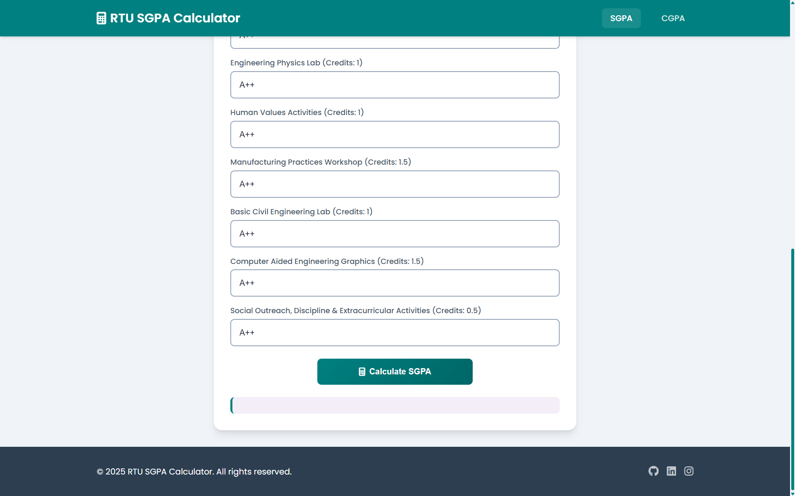
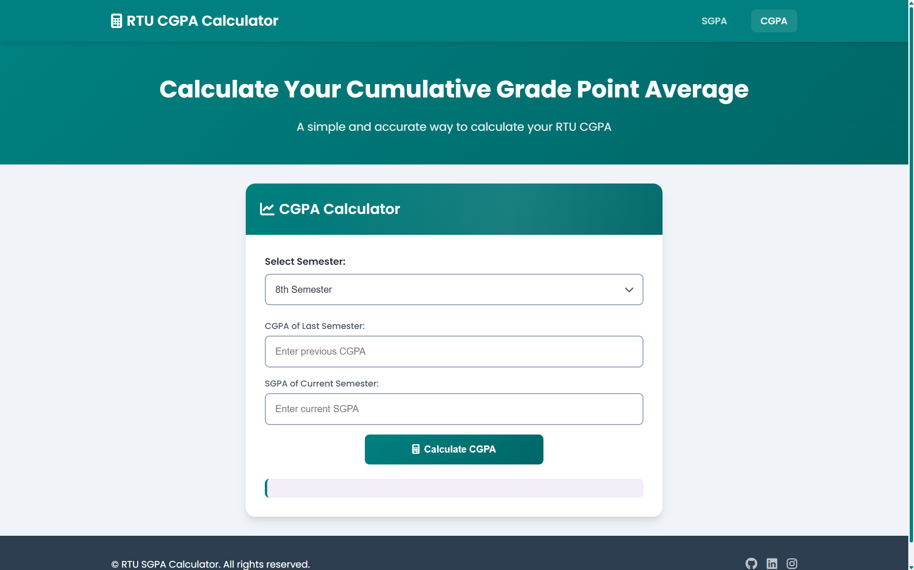

# 🎓 CGPA Calculator

---

## 🖼️ Screenshots

### 🔢 Home Page


### 🧮 SGPA Input Page


### 📊 CGPA Section


---

## 🚀 Features

- Easy semester-wise input
- Real-time CGPA calculation
- Clean and responsive UI

---

## 🛠️ Tech Stack

- HTML5 / CSS3 / JavaScript 

---

## 📦 How to Use

1. Clone the repository:
   ```bash
   git clone https://github.com/iamhimanshu98/CGPA-Calculator.git
   cd cgpa-calculator
